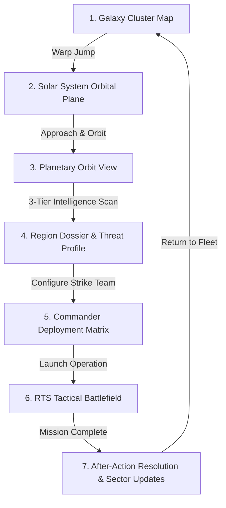

# MASSFRONT: Strategic Space Exploration & Deployment Layer
## Architectural Design & Gameplay Loop Specification

**Document Version:** 1.0.0  
**Target:** MASSFRONT Campaign & Persistent MMO Mode  
**Implementation Prototype:** `docs/mmo-space-exploration-sandbox.html`

---

## 1. Core Identity & Creative Vision

The **Strategic Space Exploration & Deployment Layer** serves as MASSFRONT's persistent operational bridge between the overarching galactic narrative and tactical real-time strategy (RTS) skirmishes.

```
┌─────────────────────────────────────────────────────────────────────────────┐
│                               CORE FANTASY                                  │
│ "I am commanding an expeditionary warship traveling through a hostile       │
│ galaxy, gathering intelligence, uncovering narrative lore and Brood threats,│
│ and choosing where and how my commanders enter the war."                    │
└─────────────────────────────────────────────────────────────────────────────┘
```

### What This Module IS:
- **Strategic Command Layer**: Traversal, sensor sweeps, threat detection, and campaign navigation.
- **Intelligence Gathering Engine**: Uncovering enemy compositions, defensive fortifications, and civilian distress signals before battle.
- **Operational Staging Matrix**: Selecting specialized hired commanders, configuring strike teams, and choosing landing zones / orbital support assets.
- **Persistent Progression Hub**: Experience, injuries, loyalty, recovered bio-samples, and galactic state consequences.

### What This Module IS NOT:
- **NOT a Manual Dogfighting Arcade Sim**: The flagship is an industrial dreadnought; movement is command-driven.
- **NOT an Endless Mineral Mining Chore**: Scanning is deduction and intelligence, not cursor sweeping.
- **NOT an Economy/Trading Spreadsheet**: High-tempo mobile focus with meaningful tactical decisions.

---

## 2. The 5-Verb Dominant Gameplay Loop

Every interaction in this module reinforces the core loop:

```
┌───────────┐      ┌────────────┐      ┌─────────┐      ┌────────┐      ┌─────────┐
│  EXPLORE  │ ───▶ │ UNDERSTAND │ ───▶ │ PREPARE │ ───▶ │ DEPLOY │ ───▶ │ RESOLVE │
└───────────┘      └────────────┘      └─────────┘      └────────┘      └─────────┘
  Galaxy &           3-Tier Intel        Commander        RTS Ground      After-Action
  System Nav         & Threat Profile    & Strike Team    Tactical Drop   Consequences
```

1. **EXPLORE**: Navigate the Galaxy Map, plot warp conduits, cruise solar systems, and investigate unresolved sensor contacts `[?]`.
2. **UNDERSTAND**: Conduct 3-tier planetary scans (Orbital Survey ➔ Directed Regional Scan ➔ Precision Probe) to build an Operational Threat Dossier.
3. **PREPARE**: Review intelligence, select the optimal Hired Commander, equip specialist support officers, and set Landing Zone & Doctrine.
4. **DEPLOY**: Launch the dropship with orbital support fire, transitioning into the RTS battle.
5. **RESOLVE**: Receive after-action intelligence, level up commanders, manage squad injuries, extract bio-samples, and witness persistent sector threat changes.

---

## 3. The 5-Tier Spatial Hierarchy



### Tier 1: Galaxy Cluster
- **Connected Hyperlane Network**: Route navigation across major sectors.
- **Sector Profiles**:
  1. *Sombrero-I (Civilized Nova Hub - 0.8 SEC)*: Heavy merchant traffic, naval shipyards, recruit outposts, baseline missions.
  2. *Orion Arc (Frontier Syndicate Grid - 0.5 SEC)*: Automated drone relays, precursor ruins, medium risk.
  3. *Helios Core / Kharon (Brood Outbreak Quarantine - 0.0 NULL)*: Deserted shipping lanes, corrupted bio-residue wrecks, massive subterranean Brood hive spires.

### Tier 2: Solar System
- **In-System Navigation**: Radiant central star, Keplerian planetary orbits, asteroid belts, stargates, and moving NPC traffic.
- **Sensor Uncertainty**: Unknown contacts appear as unidentified brackets `[?]` with signal strength meters until investigated.
- **EVE-Style Tactical Overview**: Right-side collapsible bracket grid filterable by `ALL`, `WORLDS`, `CONTACTS`, `THREATS` with live distance readouts in AU / km.
- **Flagship Commands**: `[ALIGN]`, `[WARP]` (with warp bubble tunnel speed streaks), `[ORBIT]`, `[STOP]`.

### Tier 3: Planetary Orbit & 3-Tier Intelligence
- **3D Rotating Celestial Body**: High-resolution atmospheric limb, day/night terminator shading, and orbital coordinate grid.
- **Intelligence Tiers**:
  - **Tier 1: Orbital Survey**: Instant macro readouts (major colony centers, spaceports, planetary biomes, obvious orbital Brood spires).
  - **Tier 2: Directed Regional Scan**: Targeting specific geographic sectors to detect hidden bases, distress beacons, survivor signals, and subterranean infestation tunnels.
  - **Tier 3: Precision Probe**: Deploying valuable probes on verified anomalies to unlock specific operations, story logs, or ancient technology caches.

### Tier 4: Region Dossier & Threat Profile
- Displays the operational intelligence gathered before committing forces:
  - **Brood / Hostile Density**: *EXTREME (94%)*
  - **Terrain Type**: *Dense Fungal Chasm / Basalt Canyons*
  - **Primary Hive Location**: *Sector 4 Located*
  - **Subterranean Bio-Activity**: *Active Swarm Queen detected*
  - **Civilian Survivors**: *17 trapped colonists broadcasting on emergency frequency*
  - **Recommended Doctrines**: *Flame Purge, Bio-Containment, Siege Bombardment, Scout Drones*

### Tier 5: Commander Deployment Matrix
- **Hired Commander Roster**:
  - *Commander Kael Voss (Heavy Assault / Siege)*: Unlocks orbital artillery, forward heavy base construction, breaching charges.
  - *Commander Elara Kai (Recon / Spec-Ops)*: Unlocks forward recon drones, alternate stealth LZs, instant radar reveal.
  - *Commander Tarek Stone (Armored Vanguard)*: Unlocks mechanized convoys, mobile field repair rigs, heavy armor reinforcements.
  - *Dr. Vaelis Thorne (Anti-Brood Specialist)*: Unlocks biological scanners, flame doctrine, infestation resistance.
- **Command Team Customization**: Equip 4 specialist support slots (Combat Engineer, Field Medic, Bio-Tech, Demolitions Officer).
- **Deployment Customization**: Choose Landing Zone, Orbital Support Asset, and Tactical Stance.

---

## 4. Flagship Visual Architecture (USS ZEUS NCX-221)

The flagship model procedurally rendered in the 3D space engine embodies brutalist industrial design:

```
                  ┌────────────────────────────────────────┐
                  │    UPPER CATAMARAN SAUCER HULL JAW     │
                  └──────────────────┬─────────────────────┘
                                     │
           [ SPHERICAL BRIDGE ] ─────┼───── [ 4 CYAN WARP TOROIDAL RINGS ]
           (Forward Command Eye)     │      (Field Propulsion Coils)
                                     │
                  ┌──────────────────┴─────────────────────┐
                  │    LOWER CATAMARAN SAUCER HULL JAW     │
                  └────────────────────────────────────────┘
```

1. **Dual Catamaran Hull Jaws**: Heavy armored upper and lower prow plates.
2. **Internal Gantry & Catwalk City Decks**: Visible machinery and observation decks between the hull jaws.
3. **Spherical Command Bridge**: Nestled in the forward prow with illuminated optics.
4. **4 Glowing Cyan Warp Toroidal Rings**: Wrapping the mid-to-aft cylindrical engineering spine.
5. **Aft Twin Engine Nacelles**: Emitting animated high-energy plasma trails and RCS thruster puffs.

---

## 5. Technical Implementation & Prototype Access

The fully functional, responsive, standalone prototype is located at:
- [`docs/mmo-space-exploration-sandbox.html`](file:///c:/Users/Jason/Documents/Codex/2026-08-01/massfront-rts-mobile-game-for-apple/docs/mmo-space-exploration-sandbox.html)

### Verification Test Runner
```bash
node tools/test-sandbox-standalone.mjs
```
