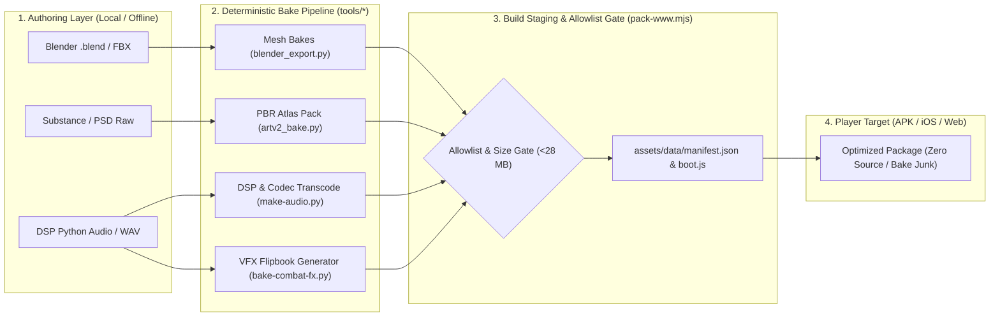

# MASSFRONT — Creative Toolchain & Asset Integration Contract

**Objective:** Define a rigorous, deterministic pipeline contract ensuring Blender modeling, PBR texture baking, VFX flipbook generation, and audio DSP tools feed the runtime asset allowlist without polluting player packages or native APKs.

---

## 1. Inventory of Current Creative & Bake Tooling

| Subsystem | Tool Path | Inputs | Outputs | Role & Status |
|---|---|---|---|---|
| **Blender Geometry Pipeline** | `tools/blender_export.py`, `tools/blender_import.mjs`, `tools/blender/render-tower-lab.py` | `.blend` sources, high-poly mesh rigs | JavaScript vertex arrays (`VFLOATS=12`), `.glb` stubs | Extracts optimized vertex buffers into `models.js` and `models-world-data.js`. |
| **Material & Texture Bakes** | `tools/bake-worldkit-building-material-v3.py`, `tools/build-bespoke-v2-textures.py`, `tools/artv2/` | Substance/PSD raw layers, SVG heightmaps | `mat-albedo-building-v3.png`, `mat-normal-building-v3.png`, `mat-orm-building-v3.png` | Packs $2048\times 2048$ PBR atlases (Albedo, Normal, ORM: Occlusion/Roughness/Metallic). |
| **Combat & VFX Flipbooks** | `tools/bake-combat-content-fx-v1.py`, `tools/bake-sc2-vfx-terrain-assets.py`, `tools/bake-raymarch-driver-v1.py` | Particle simulations, density grids | `mf-blast-flipbook-v4.png`, `mf-raymarch-density-emission-driver-v1.png` | Generates $4\times 4$ / $8\times 8$ animated sprite sheets and 3D raymarching textures. |
| **Audio Synthesis & Ingestion** | `tools/make-audio.py`, `tools/ingest-sfx.py`, `tools/ingest-music.py`, `tools/make-voices.py` | Pure DSP algorithms, WAV masters, voice takes | `assets/audio/*.ogg`, `assets/audio/*.m4a`, `sfx.json`, `voice.json` | Dual-format encoding (OGG for Chromium, AAC/M4A for Safari/iOS) with normalized loudness. |
| **Design Database Pipeline** | `tools/extract-design-db.mjs`, `tools/build-design-db.py` | Runtime JS units, buildings, research tables | `design/design.json`, SQLite database, XLSX, HTML | Single source of truth for balancing numbers. |
| **Automated QA & Verifiers** | `tools/verify-*.mjs`, `tools/capture-*.mjs`, `tools/perf-lab/` | Playwright hardware Chromium, CDP | Metric JSONs, visual screenshot diffs | Pre-release gates and visual regression tests. |

---

## 2. The Creative Toolchain Integration Contract



### 2.1 Allowlist Enforcement Rules

1. **Zero Source Artifacts in Staged Output:**
   - Raw source models (`.blend`, `.obj`, `.fbx`), high-res PSD layers, uncompressed 24-bit WAV files, intermediate bake masks, and Python bake scripts (`*.py`, `__pycache__`) must **never** be copied into `www/` or packaged into native APKs/IPAs.
   - `tools/pack-www.mjs` enforces the `shouldPack(path)` filter to guarantee rejection.

2. **Dual-Format Audio Delivery Guarantee:**
   - Every audio effect generated by DSP tools must output both `.ogg` and `.m4a` files with matching base names.
   - `assets/audio/sfx.json` must be deterministically regenerated whenever new sounds are added.

3. **PBR Texture Channel Packing Standards:**
   - **Albedo Map:** sRGB Color in RGB channels; Alpha channel reserved for emissive mask or transparency.
   - **Normal Map:** Tangent-space normals packed as $R = N_x \times 0.5 + 0.5$, $G = N_y \times 0.5 + 0.5$, $B = N_z \times 0.5 + 0.5$ (Linear Color space).
   - **ORM Map:** Packed composite texture:
     - Red ($R$): Ambient Occlusion (AO).
     - Green ($G$): Roughness ($0 = \text{mirror}, 1 = \text{matte}$).
     - Blue ($B$): Metallic ($0 = \text{dielectric}, 1 = \text{conductor}$).

4. **Mesh Geometry Optimization Standard:**
   - Units: Maximum 1,500 triangles per Tier 1/2 unit hull, 3,500 triangles for Tier 3 Titans/Heroes.
   - Buildings: Maximum 2,000 triangles per base structure.
   - Vertices must conform to the 48-byte stride: `pos(3) normal(3) col(3) uv(2) mat(1)`.

5. **Design DB Extraction Rule:**
   - Game constants and unit stats must never be hand-copied between spreadsheets and source files.
   - Editing `src/game/sim.js` $\rightarrow$ run `node tools/extract-design-db.mjs` $\rightarrow$ `python3 tools/build-design-db.py`.

---

## 3. Pre-Commit & Pre-Release Acceptance Gates

Before any new authored asset or bake script output is merged into production:

1. **Bundler Syntax & Scope Gate:**
   ```bash
   node tools/bundle.mjs
   ```
   *Must pass without identifier collisions in global scope.*

2. **Staging & Allowlist Verification:**
   ```bash
   node tools/pack-www.mjs
   ```
   *Must stage www/ and confirm 0 forbidden files, 0 404s, and APK payload size $< 29\text{ MB}$.*

3. **Visual Quality & Hardware WebGL2 Validation:**
   ```bash
   node tools/interface-audit/test-verifier-fixtures.mjs
   node tools/interface-audit/audit-interface-matrix.mjs
   ```
   *Must execute against discrete GPU and pass 100% fail-closed verification.*

---

## 4. Primary Technical References

- **Khronos glTF 2.0 Specification:** [https://registry.khronos.org/glTF/specs/2.0/glTF-2.0.html](https://registry.khronos.org/glTF/specs/2.0/glTF-2.0.html)
- **Blender Python API Reference:** [https://docs.blender.org/api/current/](https://docs.blender.org/api/current/)
- **EBU R128 Loudness Normalisation Standard for Audio:** [https://tech.ebu.ch/loudness](https://tech.ebu.ch/loudness)
- **Physically Based Shading in Theory and Practice (SIGGRAPH):** [https://blog.selfshadow.com/publications/s2014-shading-course/](https://blog.selfshadow.com/publications/s2014-shading-course/)
