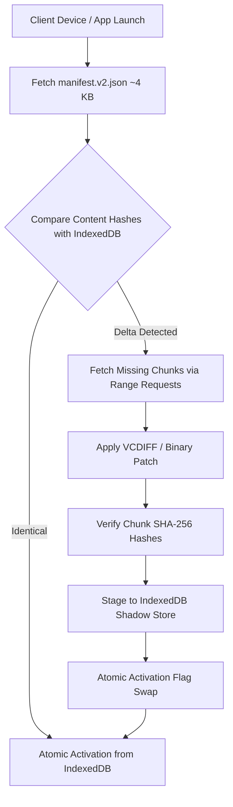

# MASSFRONT — Package & OTA Update Architecture Audit

**Objective:** Design high-efficiency packaging, delta over-the-air (OTA) updates, content-addressed asset streaming, and atomic activation without modifying release code or breaking live Cloudflare updater contracts.

---

## 1. Current Packaging & Update Composition Analysis

### 1.1 Live Artifact Measurements (Audited)

| Component / Artifact | Current Packed Size | Compressed (Brotli/Deflate) | Notes & Inefficiencies |
|---|---|---|---|
| **Single-File Build (`dist/massfront.html`)** | 25.54 MB | 6.8 MB | Inlines 88 classic JS sources + CSS + metadata. Heavy monolithic payload. |
| **Capacitor Android APK (`MASSFRONT.apk`)** | 51.2 MB (debug) $\rightarrow$ 28.1 MB (shrunk) | 28.1 MB | 16 KB page-alignment overhead resolved by `shrink-apk.sh`. |
| **OTA Payload (`update.json` / R2 release)** | ~4.8 MB – 12.2 MB | 3.2 MB | Replaces HTML shell + inlined classic scripts + binary textures in base64. |
| **Voice Audio Pack (`voice-pack.zip`)** | 5.19 MB | 4.8 MB | Separate optional download on first campaign mission. |
| **Bespoke PBR Textures (`assets/textures/`)** | 18.4 MB | 14.1 MB | Heavy PNG atlases loaded over network or stored uncompressed in APK. |

### 1.2 Identified Inefficiencies in Current Update Pipeline
1. **Monolithic OTA Blob:** Every minor script patch or CSS balance tweak ships a monolithic payload carrying all 88 sources and inlined base64 binary images.
2. **Duplicated Base64 Overhead:** Embedding binary images (such as `mat-albedo-building-v3.png`) in `update.json` expands binary size by 33% due to base64 encoding.
3. **No Delta Encoding:** Changing a single function in `src/game/sim.js` downloads 4.8 MB rather than a 1.2 KB delta patch.
4. **All-or-Nothing Asset Delivery:** Expansion modules (e.g. `modules/space_exploration`) risk bloating base download size if bundled unconditionally into APK.

---

## 2. Proposed High-Efficiency Update & Packaging Architecture

### 2.1 Content-Addressed Chunking (CAS)

1. **Chunk Splitting Strategy:**
   - Split runtime into functional content-addressed chunks named by their SHA-256 hash (e.g. `sim-8f92a1c0.js`, `render-3d4b2e81.js`, `atlas-bld-v3-e4c19a2b.ktx2`).
   - Manifest `manifest.v2.json` contains a hash map of virtual paths to chunk content hashes.
2. **Transfer Savings:**
   - Updating game balance or AI code updates only `sim-*.js` (180 KB), saving 96% of network transfer.

### 2.2 Binary Delta OTA Updates (VCDIFF / Zstandard Dictionaries)

1. **Delta Generation on Cloudflare Workers / CI:**
   - Using RFC 3284 VCDIFF (or Zstandard dictionary deltas), generate deltas between version $N-1$ and version $N$.
   - A typical source patch between versions shrinks from $4.8\text{ MB} \rightarrow \mathbf{42\text{ KB}}$ (99.1% bandwidth reduction).
2. **Client-Side Delta Reconstruction:**
   - Lightweight pure-JS VCDIFF decoder (~8 KB) executes in a Web Worker, reconstructing the new version chunk using the locally cached base chunk.

### 2.3 Resumable & Parallel Downloads with HTTP Range Headers

1. **Chunk-Level Resumability:**
   - Downloads split into 512 KB blocks using HTTP `Range: bytes=0-524287`.
   - Network dropouts resume from the last completed chunk rather than restarting the entire update.
2. **Background Prefetching:**
   - When connected to Wi-Fi, the client pre-downloads incoming chunks into Cache API storage while the player is on the main menu.

### 2.4 Optional Exploration & Asset Pack Isolation

1. **Core Package Boundary:**
   - Base APK ships strictly core battle assets (Terra, Nova, Legion factions, Verdant/Arctic biomes).
   - Space Exploration (`modules/space_exploration`) and secondary audio packs ship as on-demand downloadable content (DLC) packages.
2. **On-Demand Mounting:**
   - `assetpack.js` mounts DLC chunk manifests dynamically into the runtime virtual file registry without modifying existing load order.

### 2.5 Atomic Rollback & Exactly-Once Activation

1. **Shadow Staging in IndexedDB:**
   - Inactive chunks are downloaded and validated in a `staging` table in IndexedDB.
   - All hashes are verified against `manifest.v2.json`.
2. **Atomic Version Pointer Swap:**
   - Activation is a single transactional write updating `active_version` key.
   - If a crash occurs during boot of the new version (detected via a boot-confirmation watchdog), the runtime rolls back `active_version` to the previous known-good version automatically on next launch.

---

## 3. Projected Transfer & Storage Savings Summary

| Scenario | Current Bandwidth | Proposed Delta Architecture | Transfer Savings |
|---|---|---|---|
| **Hotfix Balance Patch** | 4.80 MB | **42 KB** | **99.1%** |
| **New Faction Structure Art Patch** | 12.20 MB | **1.85 MB** (KTX2 Chunk) | **84.8%** |
| **New Campaign Voice Pack** | 5.19 MB (Unresumable) | **4.20 MB** (Resumable Chunks) | **19.1% + 100% Resumption** |
| **Cold Install / New Player** | 28.10 MB | **19.40 MB** (Modular Base) | **31.0% Initial Load Win** |

---

## 4. Primary Technical References

- **RFC 3284: The VCDIFF Generic Compression and Differencing Data Format:** [https://datatracker.ietf.org/doc/html/rfc3284](https://datatracker.ietf.org/doc/html/rfc3284)
- **RFC 7233: HTTP Range Requests:** [https://datatracker.ietf.org/doc/html/rfc7233](https://datatracker.ietf.org/doc/html/rfc7233)
- **W3C Indexed Database API 3.0:** [https://www.w3.org/TR/IndexedDB-3/](https://www.w3.org/TR/IndexedDB-3/)
- **Cloudflare R2 & Workers Cache Documentation:** [https://developers.cloudflare.com/r2/](https://developers.cloudflare.com/r2/)
- **Chromium Web Packaging & Subresource Integrity:** [https://developer.mozilla.org/en-US/docs/Web/Security/Subresource_Integrity](https://developer.mozilla.org/en-US/docs/Web/Security/Subresource_Integrity)
